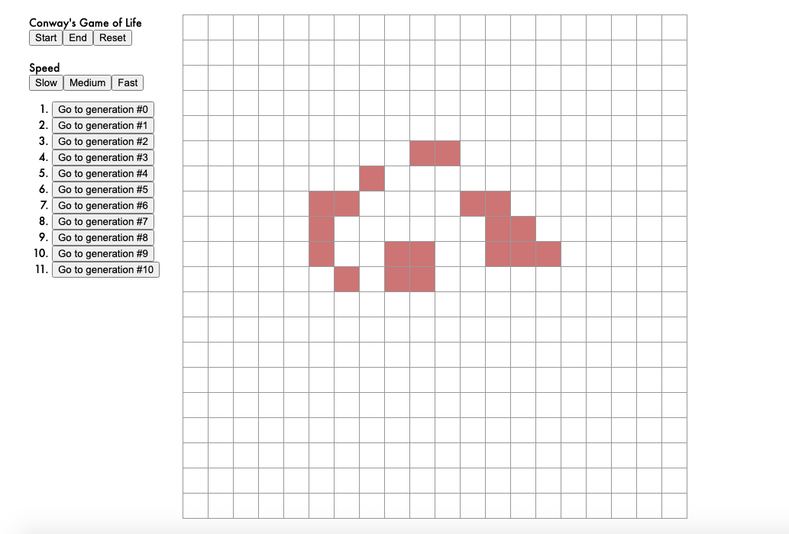
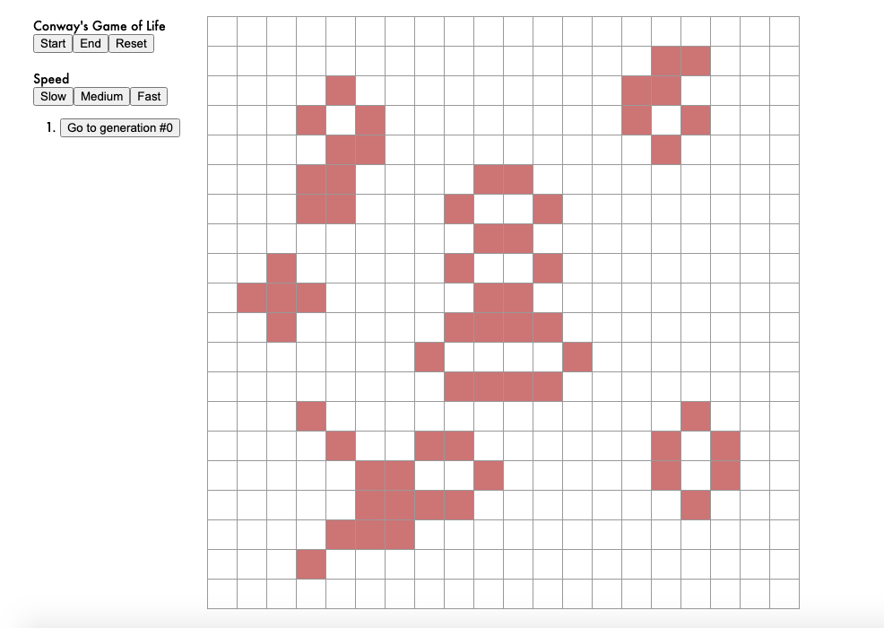
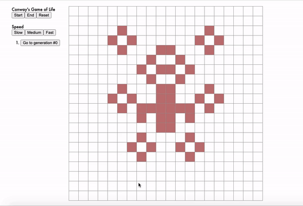

# Conway's Game of Life

A simple [interactive demo](https://bqle.github.io/conway-game-of-life/) for Conway's game of life where you populate the grid with certain squares and watch it grow!

## Description

The game of life is a world designed by John Conway to mimic town populations. Whether a grid survives to the next generation depends on its neighbors. If there are too many live neighbors, a square dies from overpopulation; if there are too few, it dies from isolation; and it moves on when the number of neighbors is just right. 
Naturally, this gives rise to many [cool patterns](https://www.youtube.com/watch?v=C2vgICfQawE&ab_channel=RationalAnimations).
With this demo, you can try some of them out for yourself!

### Running the demo

* Create some patterns of your choice by clicking the squares on the grid
* Press "Start" on the left column to simulate the game
* Configure the update speed however you want on the left hand side. 
* Press "End" at any point to stop the simulation. Or the game will stop once the grid doesn't change from one generation to the next.
* You can go back to any previou generations by clicking from the generated list on the left. 
You can also edit a generation at any point and press start again to see how it change!
* Have some fun in the sun!

## Demo

## Author

 [@Benjamin Le](bqle@seas.upenn.edu)

## Acknowledgments

* [Conway's Game of Life](https://en.wikipedia.org/wiki/Conway%27s_Game_of_Life)
